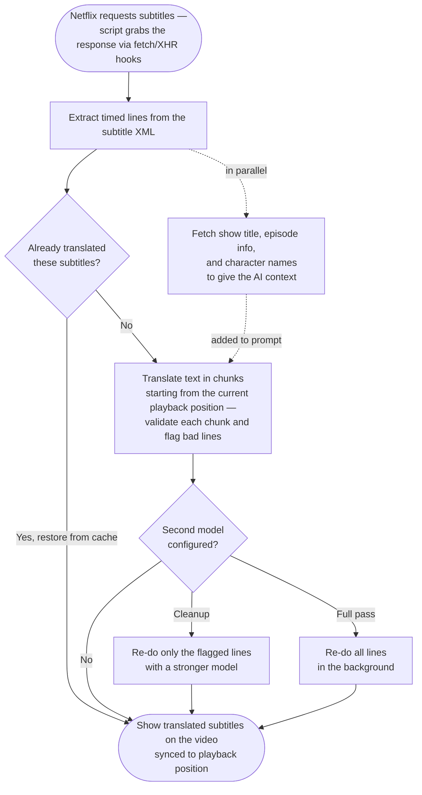

# Netflix Subtitle Translator

A Tampermonkey userscript that translates Netflix subtitles in real-time using AI. It intercepts subtitle data, translates it via your chosen provider, and overlays the result on the video player.

## Features

- **Real-time translation** — translated subtitles appear as you watch
- **Multiple AI providers** — Gemini (free), Groq (free), Mistral (free), OpenAI, DeepSeek, Ollama (local/private), and more
- **Caching** — translations persist locally, rewatching is instant
- **Dual subtitles** — show original and translated text together
- **Show-aware** — fetches character names and episode info to improve translations
- **Speaker name normalization** — learns character names across chunks for consistent output
- **Two-model pipeline** — optional second model for a cleanup or full-quality pass
- **Transcript panel** — scrollable full-text view alongside the video
- **Auto-validation** — detects and retries bad translations

## Quick Start

| Item | Cost |
|------|------|
| Chrome or Firefox | Free |
| [Tampermonkey](https://www.tampermonkey.net/) | Free |
| [Google Gemini API key](https://aistudio.google.com/apikey) | Free |
| Netflix subscription | Your existing plan |

1. **Install Tampermonkey** from [Chrome Web Store](https://chrome.google.com/webstore/detail/tampermonkey/dhdgffkkebhmkfjojejmpbldmpobfkfo) or [Firefox Add-ons](https://addons.mozilla.org/en-US/firefox/addon/tampermonkey/)

2. **Install the script** — click below or paste the raw URL into Tampermonkey:

   > [Install netflix-subtitle-translator.user.js](#)
   > *(Replace with your raw GitHub URL after uploading)*

3. **Get a free Gemini API key** from [aistudio.google.com/apikey](https://aistudio.google.com/apikey)

4. **Configure** — play any show on Netflix, press `Shift + T`, select Gemini, paste your key, set your target language. Settings are saved automatically.

5. **Watch** — enable subtitles in the Netflix player. The translator handles the rest.

> **Chrome users:** Tampermonkey needs Developer mode. Go to `chrome://extensions`, find Tampermonkey, click Details, enable "Allow access to file URLs" and allow user scripts.

## Keyboard Shortcuts

| Key | Action |
|-----|--------|
| `Shift + T` | Settings panel |
| `Shift + S` | Master on/off (stops all translation) |
| `S` | Toggle translated subtitles on/off |
| `O` | Dual subtitles (original + translation) |
| `Shift + O` | Show original text on flagged lines |
| `L` | Transcript panel |
| `R` | Retry current chunk |
| `Shift + A` | Retranslate everything from current position |
| `Shift + C` | Clear translation cache |
| `D` / `E` | Timing offset (Delay / Earlier) |

## Translation Providers

| Provider | Cost | Notes |
|----------|------|-------|
| **Ollama** (local) | Free | Fully private, runs on your machine. Requires [Ollama](https://ollama.com/). |
| **Google Gemini** | Free tier | ~60 episodes/day with Flash Lite. Not available in EU/EEA/UK/CH. |
| **Groq** | Free tier | Very fast inference. Highest free daily quota. |
| **Mistral** | Free tier | Strong multilingual. Phone verification required. |
| **DeepSeek** | Very cheap | Good quality. [deepseek.com](https://platform.deepseek.com/) |
| **OpenAI** | Paid | GPT-4o-mini is affordable. [platform.openai.com](https://platform.openai.com/) |
| **OpenRouter** | Varies | Many models, one API. Pay-per-use. |

### Ollama (Local & Private)

1. Install from [ollama.com](https://ollama.com/)
2. `ollama pull qwen2.5:7b`
3. Select Ollama in the script settings (default URL: `http://localhost:11434`)

The script auto-discovers your installed models. For better quality, pair a fast small model (qwen2.5:3b) as first pass with a larger one (qwen2.5:7b) as second model.

## How It Works

The script intercepts Netflix's subtitle data (TTML/XML), translates the text via your chosen AI provider, and overlays the result on the video. It also fetches show metadata to give the AI context about character names and episode info.

### Architecture

Single self-contained userscript (~3800 lines). Here's the processing pipeline:



### Key Concepts

**SES lockdown** — Netflix freezes `fetch` and `XMLHttpRequest` via Secure EcmaScript (SES) shortly after page load. The script runs at `document-start` to hook these first. If SES wins the race, a PerformanceObserver fallback re-fetches subtitle URLs through `GM_xmlhttpRequest`.

**Chunked translation** — Subtitles are split into chunks (default 50 lines) with a 10-line overlap for context continuity. Chunks are reordered on the fly when the user seeks — the chunk nearest the playback position always goes first.

**Fast Start** — A half-size chunk at the current position is translated immediately before the main loop begins. Gets subtitles on screen in seconds. The main loop retranslates this range later with full context.

**Validation & flagging** — Each chunk is checked for correct line count and untranslated text (detected by script-family analysis, e.g. CJK remaining when target is English). Bad lines are flagged for the cleanup pass or manual retry with `R`.

**Show context** — The script fetches the Netflix video ID, queries Netflix's metadata API for title/synopsis/episode, then searches Cinemeta for character names. This is injected into the LLM system prompt so names are translated correctly.

**Speaker name normalization** — As chunks are translated, the script learns which source-language speaker labels map to which target-language names. It picks canonical forms (preferring cast data, then frequency + plausibility) and back-fills earlier chunks.

**Two-model pipeline** — An optional second model runs after the primary pass. *Cleanup mode* retranslates only flagged lines. *Full pass mode* retranslates everything in the background.

**Caching** — Translations are stored in `localStorage` keyed by `provider:model:targetLang:contentHash`. A per-URL entry stores translated + original cues, flagged lines, and resume state for instant restore on reload.

**SPA navigation** — The script intercepts `pushState` and `popstate` to detect episode changes without page reloads. On navigation, state resets and the cache is checked for the new URL.

## Disclaimer

> **Not affiliated with Netflix, Inc.**
>
> Independent, open-source tool for **personal, non-commercial use** to assist with language accessibility. Intended for Netflix subscribers on their own accounts.
>
> **Users are responsible for complying with Netflix's [Terms of Use](https://help.netflix.com/legal/termsofuse)** and applicable laws. Netflix's TOS includes provisions regarding automated access and code injection that may apply to userscripts.
>
> **Copyright & TOS notice:** Netflix subtitle text is copyrighted material. Processing it locally is similar to reading it on screen. However, sending subtitles to a cloud AI provider (Gemini, OpenAI, etc.) constitutes transmitting copyrighted content to a third party, which may constitute redistribution and could be against Netflix's TOS and/or applicable law depending on your jurisdiction. **Use a local provider (Ollama) if this is a concern.** You are solely responsible for how you use this tool.
>
> Does not circumvent DRM or download/store/redistribute video content.
>
> **Provided "as is" without warranty. Use at your own risk.**
>
> If Netflix requests removal, maintainers will comply.

## Privacy

- API keys are stored locally in Tampermonkey's storage, sent only to your configured provider.
- Show metadata comes from Netflix's own API (your session) and [Cinemeta](https://github.com/Stremio/stremio-addon-sdk) (public, open-source).

When using cloud providers, subtitle text (copyrighted material) is sent to third-party servers — similar to pasting into Google Translate. For full privacy, use **Ollama** for local translation.

## Development

### Setup

```bash
make install   # install dependencies
make test      # run unit tests
make build     # build the .user.js bundle
make check     # lint + validate
```

### Headless CLI

A Node.js CLI lets you run the translation pipeline without a browser — useful for testing models, evaluating quality, and iterating on prompts.

Translations run against episode files (TTML subtitle XML) stored in `episodes/`. A few synthetic smoke episodes are included in the repo; real episodes go in `episodes-local/` (gitignored).

#### Config presets

Configs live in `configs/` as flat JSON files. Two examples are tracked:

- `ci-smoke.json` — cloud provider, used in CI
- `example-ollama.json` — local Ollama base config, no API key needed
- `example-ollama-3b.json` — extends the base with a specific model

Create your own by copying an example. Configs support `"extends"` to inherit from a base config, so you only need to specify what differs.

#### Commands

```bash
# Translate a single episode
make headless CONFIG=example-ollama EPISODE=smoke-test

# Translate all discovered episodes
make headless-all CONFIG=example-ollama

# Re-evaluate existing translations (no LLM calls)
make headless-evaluate CONFIG=example-ollama

# Analyze translation quality (name consistency, artifacts, etc.)
make headless-analyze CONFIG=example-ollama EPISODE=smoke-test

# View run history with quality scores
make headless-history CONFIG=example-ollama
```

Output goes to `runs/<config>/<episode>/<run>/`.

Run `make help` for the full list of commands.

## Contributing

This entire project is vibe-coded — every line of code, every test, even this README was generated by AI. Not a single line was written manually.

Open an issue first. I probably won't review large PRs.

## License

[MIT](LICENSE)
